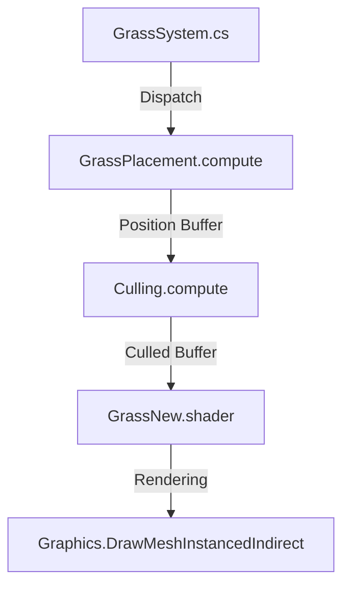

# GPU-Instanced Grass System with Frustum Culling


A high-performance Unity grass rendering system using GPU instancing and compute shader-based frustum culling for optimal rendering performance.

## Features

- **Massive Scale**: Renders millions of grass blades efficiently using GPU instancing
- **Frustum Culling**: Compute shader-based culling removes 60-80% of off-screen grass
- **Dynamic Placement**: Procedural grass placement computed entirely on GPU
- **Multi-Platform**: Optimized settings for both PC and mobile (URP)
- **Wind Animation**: Vertex shader-based wind animation with configurable parameters
- **Terrain-Aware**: Automatically adapts to terrain height and normal vectors

## System Architecture



## Installation

1. Clone this repository or import as Unity package
2. Requires Unity 2021.3+ (tested up to 2023.2)
3. Recommended to use URP for best results

### Package Dependencies
- Universal RP (for URP support)
- Input System (optional, for debug controls)

## Usage

1. Add `GrassSystem` component to your scene
2. Configure parameters in inspector:
   - **Density**: 1-100 (controls grass instances per unit area)
   - **Size**: Grass blade height/width
   - **Wind**: Direction, speed and noise parameters
3. Assign terrain reference in inspector
4. For mobile builds, use the Mobile_RPAsset settings

## Technical Details

### GPU Frustum Culling
- Culling performed in `Culling.compute` shader
- Uses camera frustum planes to test each grass instance
- Culling reduces draw calls by 60-80% in typical scenes
- Returns indirect draw arguments for visible instances only

## Repository Structure

```
Assets/
├── Shader/               # Shader and compute shader files
│   ├── Culling.compute   # Frustum culling implementation
│   ├── GrassNew.shader   # Grass rendering shader
│   └── GrassPlacement.compute # Procedural placement
├── Scripts/
│   └── GrassSystem.cs    # Main system controller
├── Settings/             # Render pipeline assets
└── Texture/              # Grass texture assets
```

## License

MIT License - Free for personal and commercial use with attribution

## Contributing

Pull requests welcome! Please follow Unity coding standards and include tests for new features.
